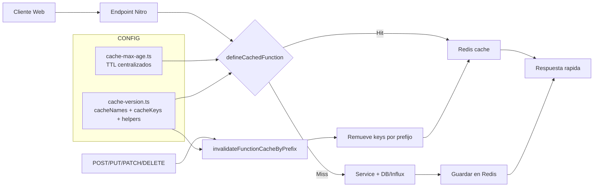

# GPS Cache Guide

Esta guia documenta el sistema de cache server-side del modulo GPS.

## 1) Donde vive la cache

- Storage Nitro: `cache` en Redis (prod y dev).
- Config global en `nuxt.config.ts`:
  - `nitro.storage.cache` y `nitro.devStorage.cache` -> Redis (`REDIS_URL`).
  - `routeRules['/telemetry/realtime'] = { cache: false }` para no cachear el stream en vivo.

## 2) Puntos centrales

- TTL centralizados: `layers/gps/server/utils/cache-max-age.ts`.
- Nombres/keys/invalidacion/logs: `layers/gps/server/utils/cache-version.ts`.
- Estrategia por endpoint:
  - Lecturas/reportes: `defineCachedFunction(..., { name, maxAge, swr: true, getKey })`.
  - Escrituras: invalidan cache con `invalidateFunctionCacheByPrefix(...)`.

## 3) Como se forman las keys

En `cache-version.ts`:

- `cacheKeys.all()` -> `all`
- `cacheKeys.id(id)` -> `"<id>"`
- `cacheKeys.fleetsAvailable(includePlate)` -> `includePlate.trim()` o `all`
- `cacheKeys.geofenceStaysReport(deviceIds, startISO, endISO)` ->
  `"<devices ordenados por sort join(',')>:<startISO>:<endISO>"`

En reportes de mapa (`route/speed/stops/distance/route-analysis`), el `getKey` usa la misma idea:

- `normalizedDevices = [...devices].sort().join(',')`
- key final: `"<normalizedDevices>:<startISO>:<endISO>"`

Esto evita duplicados por orden distinto de dispositivos.

## 4) Grupos de cache (cache names)

Definidos en `cacheNames`:

- `gps:fleets:available`
- `gps:fleets:basic`
- `gps:equipment:list`
- `gps:fleet-equipment:all`
- `gps:fleet-equipment:active`
- `gps:geofence:list`
- `gps:alerts:list`
- `gps:alert-logs:list`
- `gps:geofence-stays:report`
- Reportes mapa usan nombres directos:
  - `gps:map:route`
  - `gps:map:stops`
  - `gps:map:speed`
  - `gps:map:distance`
  - `gps:map:route-analysis`

## 5) Endpoints con cache

### GET cacheados

- `server/api/equipment/index.get.ts` -> `gps:equipment:list`, key `all`, TTL `equipmentList`.
- `server/api/fleets/index.get.ts` -> `gps:fleets:basic`, key `all`, TTL `fleetsBasic`.
- `server/api/fleets/available.get.ts` -> `gps:fleets:available`, key `fleetsAvailable(includePlate)`, TTL `fleetsAvailable`.
- `server/api/equipmentFeet/index.get.ts` -> `gps:fleet-equipment:all`, key `all`, TTL `fleetAssignmentsAll`.
- `server/api/equipmentFeet/active/index.get.ts` -> `gps:fleet-equipment:active`, key `all`, TTL `fleetAssignmentsActive`.
- `server/api/geofence/index.get.ts` -> `gps:geofence:list`, key `all`, TTL `geofenceList`.
- `server/api/gps-alert/index.get.ts` -> `gps:alerts:list`, key `all`, TTL `gpsAlerts`.
- `server/api/gps-alert/[id].get.ts` -> `gps:alerts:list`, key `id`, TTL `gpsAlerts`.
- `server/api/gps-alert-logs/index.get.ts` -> `gps:alert-logs:list`, key `all`, TTL `gpsAlertLogs`.
- `server/api/gps-alert-logs/[id].get.ts` -> `gps:alert-logs:list`, key `id`, TTL `gpsAlertLogs`.
- `server/api/gps-alert-logs/by-alert/[alertaId].get.ts` -> `gps:alert-logs:list`, key `alertaId`, TTL `gpsAlertLogs`.
- `server/api/gps-alert-logs/by-equipment/[equipmentId].get.ts` -> `gps:alert-logs:list`, key `equipmentId`, TTL `gpsAlertLogs`.

### POST de reporte cacheados

- `server/api/map/route.post.ts` -> `gps:map:route`, key `devices+start+end`, TTL `mapRoute`.
- `server/api/map/stops.post.ts` -> `gps:map:stops`, key `devices+start+end`, TTL `mapStops`.
- `server/api/map/speed.post.ts` -> `gps:map:speed`, key `devices+start+end`, TTL `mapSpeed`.
- `server/api/map/distance.post.ts` -> `gps:map:distance`, key `devices+start+end`, TTL `mapDistance`.
- `server/api/map/route-analysis.post.ts` -> `gps:map:route-analysis`, key `devices+start+end`, TTL `mapRouteAnalysis`.
- `server/api/geofence-stays/report.post.ts` -> `gps:geofence-stays:report`, key `devices+start+end`, TTL `geofenceStaysReport`.

## 6) Quienes invalidan (inhiben) cache

- `server/api/equipment/index.post.ts`
  - invalida `gps:equipment:list`.

- `server/api/equipment/[id].put.ts`
  - invalida `gps:equipment:list`.

- `server/api/equipmentFeet/index.post.ts`
  - invalida `gps:fleets:available`.
  - invalida `gps:fleet-equipment:all`.
  - invalida `gps:fleet-equipment:active`.

- `server/api/equipmentFeet/[id].patch.ts`
  - invalida `gps:fleets:available`.
  - invalida `gps:fleet-equipment:all`.
  - invalida `gps:fleet-equipment:active`.

- `server/api/geofence/index.post.ts`
  - invalida `gps:geofence:list`.
  - invalida `gps:geofence-stays:report`.

- `server/api/geofence/[id].ts` (`PATCH`/`DELETE`)
  - invalida `gps:geofence:list`.
  - invalida `gps:geofence-stays:report`.

- `server/api/gps-alert/index.post.ts`
  - invalida `gps:alerts:list`.

- `server/api/gps-alert/[id].patch.ts`
  - invalida `gps:alerts:list`.

- `server/api/gps-alert/[id].delete.ts`
  - invalida `gps:alerts:list`.

- `server/api/gps-alert-logs/index.post.ts`
  - invalida `gps:alert-logs:list`.

- `server/api/alert/index.post.ts`
  - si se crea alerta de velocidad, invalida `gps:alert-logs:list`.

## 7) Diagrama de flujo de cache

## 8) TTL actuales

Desde `cache-max-age.ts`:

- `mapRoute = 30s`
- `mapStops = 30s`
- `mapSpeed = 30s`
- `mapRouteAnalysis = 30s`
- `mapDistance = 60s`
- `fleetsAvailable = 60s`
- `fleetsBasic = 60s`
- `equipmentList = 60s`
- `fleetAssignmentsAll = 60s`
- `fleetAssignmentsActive = 60s`
- `gpsAlerts = 30s`
- `gpsAlertLogs = 30s`
- `geofenceStaysReport = 60s`
- `geofenceList = 300s`

## 9) Notas operativas

- Todas las rutas `*.get.ts` bajo `layers/gps/server/api` estan cacheadas.
- `swr: true` en handlers cacheados: permite responder con valor cacheado mientras revalida.
- Si agregas un nuevo endpoint GET, replica este patron:
  1. elegir `cacheName`
  2. definir `getKey` estable
  3. usar TTL desde `cache-max-age.ts`
  4. agregar invalidacion en los endpoints de escritura afectados
